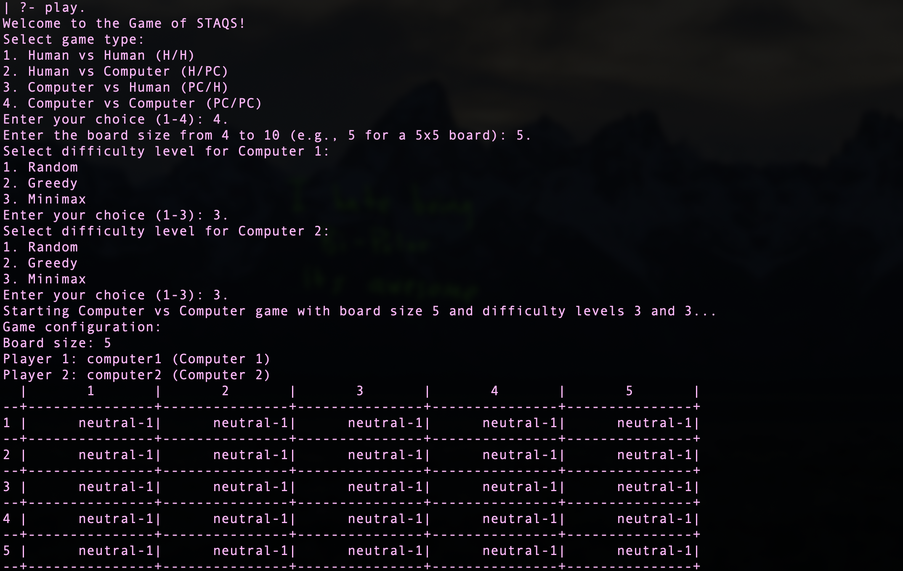
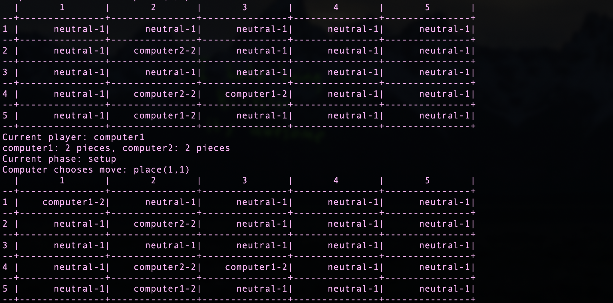
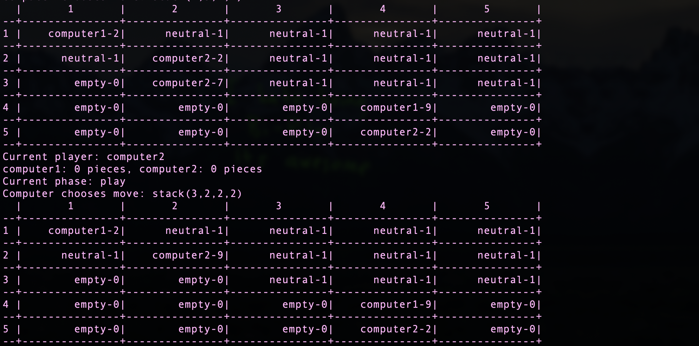
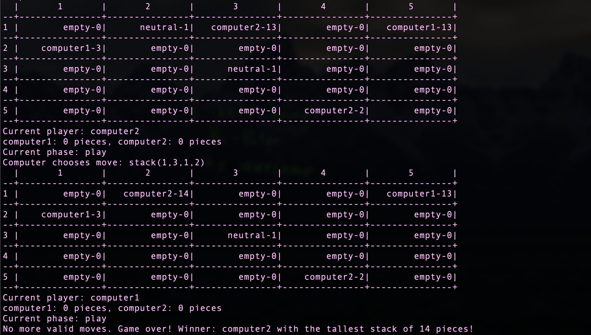

# README

## Identification of the Topic and Group

**Topic:** Game of STAQS

**Group Designation:** STAQS_9

**Members:**
1. **Student Number:** up202108698

   **Full Name:** Tomás Rebelo da Silva

   **Contribution:** 100%  

   **Tasks Performed:** All of them

## Installation and Execution

### Prerequisites
- SICStus Prolog 4.9

### Linux and Windows
1. **Install SICStus Prolog 4.9:**
   Follow the instructions on the [SICStus Prolog website](https://sicstus.sics.se/download4.html) to download and install the appropriate version for your Linux distribution.

### Instalation

1. **Clone the Git Repository:**
```sh
git clone https://github.com/tomassilva03/PFL-TP2 
```
### Execution

1. **Launch SICStus and consult game.pl:**
```prolog
['/path/to/file/game.pl'].
```

2. **Initiate the Game:**
```prolog
play.
```

3. **Select desired game mode, board size and consequent difficulty in SICStus:**
```
Welcome to the Game of STAQS!
Select game type:
1. Human vs Human (H/H)
2. Human vs Computer (H/PC)
3. Computer vs Human (PC/H)
4. Computer vs Computer (PC/PC)
Enter your choice (1-4): 4.
Enter the board size from 4 to 10 (e.g., 5 for a 5x5 board): 5.
```
Don't forget to put '.' at the end of each input.

4. **Play the game.**

## Description of the Game

**STAQS** is a strategic board game where players compete to control the tallest stacks of pieces on a grid. The game is played on a square board, with each cell initially containing a neutral piece. Players take turns placing their pieces on the board or stacking their pieces on top of existing stacks. The objective is to create the tallest stack of pieces by the end of the game.

### Rules:
1. **Setup Phase:**
   - Players take turns placing their pieces on any neutral cell on the board.
   - The setup phase continues until all pieces are placed.

2. **Play Phase:**
   - Players take turns moving their stacks.
   - Players can only stack their pieces on top of their own stacks or neutral stacks.
   - Stacks can only be moved orthogonally (horizontally or vertically) to an adjacent cell.

3. **End of the Game:**
   - The game ends when no more valid moves are available for both players.
   - The player with the tallest stack wins the game.
   - In case of a tie in the tallest stack, the player with the second tallest stack wins.

### References:
- [Official Game Website](https://boardgamegeek.com/boardgame/425529/staqs)

## Considerations for Game Extensions

### Variable-Sized Boards
When extending the game design to support variable-sized boards, the following considerations were taken into account:

1. **Board Initialization:**
   - The game should allow players to choose the board size at the start of the game.
   - The board size can range from 4x4 to 10x10, providing flexibility for different game durations and strategies.

2. **Game Balance:**
   - The rules and mechanics should be adjusted to ensure balanced gameplay across different board sizes.
   - Larger boards may require additional pieces or modified rules to maintain the game's strategic depth.

3. **User Interface:**
   - The user interface should dynamically adjust to display the chosen board size.
   - Input validation should ensure that players enter valid board sizes within the allowed range.

4. **Performance:**
   - The implementation should be optimized to handle larger board sizes without significant performance degradation.
   - Efficient algorithms for move validation and game state evaluation are crucial for maintaining a smooth gameplay experience.

These considerations ensure that the game remains engaging and balanced, regardless of the chosen board size.

## Game Logic

### Game Configuration Representation
The game configuration is represented by a list of parameters that define the initial setup of the game. This includes the board size, player types, optional rules, and player names. The `initial_state/2` predicate uses this configuration to set up the initial game state.

### Internal Game State Representation
The internal game state is represented by a `state/5` structure:
- `Board`: A list of lists representing the board, where each cell contains a piece or stack in the format `Player-Count`.
- `CurrentPlayer`: The player whose turn it is to move.
- `Pieces`: A list of remaining pieces for each player.
- `Phase`: The current phase of the game (`setup` or `play`).
- `BoardSize`: The size of the board.

Example representations:
- Initial state: `state([[n-1, n-1, n-1, n-1, n-1], [n-1, n-1, n-1, n-1, n-1], [n-1, n-1, n-1, n-1, n-1], [n-1, n-1, n-1, n-1, n-1], [n-1, n-1, n-1, n-1, n-1]], blue, [blue-4, white-4], setup, 5)`
- Intermediate state: `state([[blue-2, n-1, n-1, n-1, white-2], [blue-2, n-1, n-1, n-1, n-1], [n-1, n-1, blue-2, n-1, white-2], [n-1, n-1, n-1, blue-2, n-1], [white-2, white-2, n-1, n-1, n-1]], blue, [blue-0, white-0], play, 5)`
- Final state: `state([[blue-9, e-0, e-0, e-0, white-9], [e-0, e-0, e-0, e-0, e-0], [e-0, e-0, blue-7, e-0, white-7], [e-0, e-0, e-0, blue-2, e-0], [white-4, e-0, e-0, e-0, e-0]], blue, [blue-0, white-0], play, 5)`

### Move Representation
Moves are represented by structures indicating the type of move and the coordinates involved:
- `place(Y, X)`: Place a piece at the specified coordinates during the setup phase.
- `stack(Y1, X1, Y2, X2)`: Move a stack from one cell to an adjacent cell during the play phase.
- `skip`: Skip the turn if no valid moves are available.

The `move/3` predicate applies the move to the game state and returns the new state.

### User Interaction
The game menu system allows players to select the game type, board size, and difficulty level. Interaction with the user is performed through prompts and input validation to ensure valid moves are entered. The `get_player_move/4` predicate handles user input and validates moves.

## Conclusions

### Limitations
One of the main limitations of the current implementation is the lack of strategic depth during the setup phase. In this phase, players place their pieces on the board, but there isn't much room for strategic decision-making. As a result, the AI uses only the random move selection algorithm during the setup phase, regardless of the chosen difficulty level. This simplifies the setup phase but may not provide the most engaging experience for players looking for a more challenging AI opponent from the start.

Another limitation is the inability to perform input validation for some inputs. While we have implemented validation for player moves during the game, other inputs such as game type, board size, and difficulty level are not fully validated, which may lead to unexpected behavior or errors.

### Possible Improvements
1. **Enhanced AI for Setup Phase:**
   - Develop more sophisticated algorithms for the setup phase to introduce strategic depth and make the game more challenging from the beginning.

2. **Additional Game Modes:**
   - Introduce new game modes with different rules or objectives to provide variety and cater to different player preferences.

3. **Improved User Interface:**
   - Enhance the user interface to provide a more intuitive and visually appealing experience, including better input validation and error handling.

4. **Performance Optimization:**
   - Further optimize the game logic to handle larger board sizes and more complex game states efficiently.

### Future Developments Roadmap
1. **AI Enhancements:**
   - Implement advanced AI strategies for both the setup and play phases, including machine learning techniques to adapt to player behavior.


### Conclusions about the Work Carried Out
The development of the STAQS game in Prolog has been a valuable learning experience, providing insights into game design, AI algorithms, and user interaction. The project successfully implemented a functional game with variable-sized boards and different difficulty levels. However, there are areas for improvement, particularly in enhancing the AI's strategic capabilities during the setup phase and optimizing performance for larger boards. Additionally, improving input validation for all user inputs is necessary to ensure a robust and error-free gaming experience. Overall, the project demonstrates the potential of Prolog for developing complex logic-based games and sets the foundation for future enhancements and extensions.

## Minimax Algorithm Strategy

### Overview
The minimax algorithm is used to determine the best move for the AI by simulating all possible moves and their outcomes up to a certain depth. It aims to maximize the AI's advantage while minimizing the opponent's advantage. The algorithm evaluates the game state and assigns a score based on the potential outcomes.

### Strategy
1. **Move Simulation:**
   - The algorithm simulates all possible moves for the AI and the opponent up to a specified depth.
   - For each move, it generates a new game state and recursively evaluates the resulting game states.

2. **Evaluation Function:**
   - The evaluation function assigns a score to each game state based on two factors: the tallest stack created by the AI and the proximity of the AI's stacks to the opponent's stacks.
   - The score is calculated by finding the maximum stack height for the AI's pieces on the board and subtracting the total distance of the AI's stacks from the opponent's stacks. This encourages the AI to create tall stacks while also positioning its stacks close to the opponent's stacks to limit their available moves.

3. **Maximizing and Minimizing:**
   - The algorithm alternates between maximizing the AI's score and minimizing the opponent's score.
   - At each level of the recursion, the algorithm chooses the move that maximizes the AI's score if it is the AI's turn, or minimizes the opponent's score if it is the opponent's turn.

4. **Depth Limit:**
   - The algorithm uses a depth limit to control the number of levels it explores in the game tree.
   - When the depth limit is reached, the evaluation function is used to assign a score to the game state.

5. **Best Move Selection:**
   - After evaluating all possible moves, the algorithm selects the move with the highest score for the AI.
   - This move is considered the best move based on the current game state and the specified depth.

## Tests

### Overview
The STAQS game includes a comprehensive suite of tests to ensure the correctness and robustness of the game logic. The tests are implemented using the Prolog `plunit` library and cover various aspects of the game, including game state transitions, move validation, and AI behavior.

### Running the Tests
To run the tests, follow these steps:

1. **Launch SICStus Prolog and consult the `game.pl` file:**
    ```prolog
    ['/path/to/file/game.pl'].
    ```

2. **Run the tests:**
    ```prolog
    run_tests.
    ```

### Test Cases
The test suite includes the following test cases:

1. **Game State Tests:**
    - `game_not_ended_with_valid_moves`: Ensures the game does not end if valid moves exist.
    - `game_ended_with_no_valid_moves_and_winner_blue`: Ensures the game ends correctly and determines the winner when no valid moves exist.
    - `game_ended_with_winner_white_after_draw`: Ensures the correct winner is determined in case of a draw in the tallest stack.
    - `game_ended_with_draw`: Ensures the game ends in a draw when no valid moves exist and no player has a taller stack.
    - `game_transition_setup_to_play`: Ensures the game transitions from setup phase to play phase.

2. **Move Validation Tests:**
    - `player_can_skip_turn`: Ensures a player can skip their turn if no valid moves are available.
    - `player_can_place_piece_on_board`: Ensures a player can place a piece on the board during the setup phase.
    - `player_can_stack_a_stack_on_top_of_another_stack`: Ensures a player can stack a piece on top of another stack.
    - `player_can_stack_a_stack_on_top_of_a_neutral_cell`: Ensures a player can stack a piece on top of a neutral cell.
    - `invalid_move_setup_outside_boundaries`: Ensures an invalid move is detected when placing a piece outside the board boundaries during the setup phase.
    - `invalid_move_setup_occupied_cell`: Ensures an invalid move is detected when placing a piece on an occupied cell during the setup phase.
    - `invalid_move_play_non_adjacent_cell`: Ensures an invalid move is detected when stacking a piece on a non-adjacent cell during the play phase.
    - `invalid_move_play_non_orthogonal_cell`: Ensures an invalid move is detected when stacking a piece on a non-orthogonal cell during the play phase.
    - `invalid_move_play_opponents_cell`: Ensures an invalid move is detected when stacking a piece from an opponent's cell during the play phase.

3. **AI Behavior Tests:**
    - `random_ai_makes_valid_move_setup`: Ensures the random AI makes a valid move during the setup phase.
    - `random_ai_makes_valid_move_play`: Ensures the random AI makes a valid move during the play phase.
    - `greedy_ai_makes_valid_move_play`: Ensures the greedy AI makes a valid move during the play phase.
    - `minimax_ai_makes_valid_move_play`: Ensures the minimax AI makes a valid move during the play phase.

4. **Game Initialization Tests:**
    - `game_initializes_with_different_board_sizes`: Ensures the game initializes correctly with different board sizes.

These tests help ensure that the game logic is functioning correctly and that the AI behaves as expected under various conditions.

## Images

### Initial Menu and Board Setup


### Move in the Setup Phase


### Move in the Play Phase


### Final Move and Final Board
